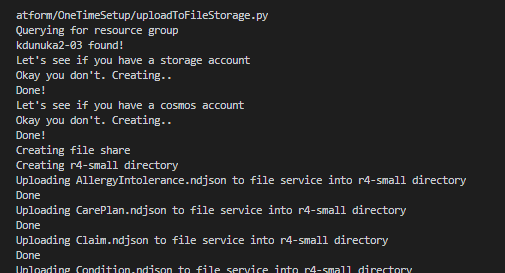
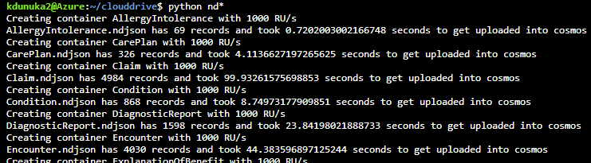

## What to run
- Run only [uploadToFileStorage.py](uploadToFileStorage.py)
- This is slow but required only once
- This also uploads [ndjson2cosmos.py](uploadToFileStorage.py) file which is to be run in Azure Cloud Shell for best performance
- All the variables used in different files can be found in "config.py" which is created only after running [uploadToFileStorage.py](uploadToFileStorage.py)

## What does each file do 
1. [createResources.py](createResources.py) : 
This file reads the required parameters (like the name, location etc.) for creating storage and CosmosDB accounts from the json files present in the templates folder using azure-cli

2. [generateConfig.py](generateConfig.py) : 
This file generates a config.py file which contains all the credentials of the azure account like the primary keys, URL endpoints of storage and CosmosDB accounts and also stores the file share name and directory
It imports [createResources.py](createResources.py) file before generating config.py file.

3. [uploadToFileStorage.py](uploadToFileStorage.py) : 
This is the only file that we have to run on our local system. It imports [generateConfig.py](generateConfig.py) and config.py files. After that it uploads all the .ndjson files to file share.

4. [ndjson2cosmos.py](ndjson2cosmos.py) : 
This file creates cosmos database and containers and adds items into their respective containers
It imports the config.py file create in generateConfig.py file for getting all the credentials of the cosmos account.
We need to run this file on azure cloud shell for best performance.

## Sequence of execution
1. Go to templates folder and in the [cosmosParameters.json](templates/cosmosParameters.json) file, you can change the name of the cosmos account and location to your desired ones.
2. You can change other parameters like MultipleWriteLocations and Database kind in [cosmosTemplate.json](templates/cosmosTemplate.json)
2. Repeat the same process for your storage account using [storageParameters.json](templates/storageParameters.json) file.
3. Run the [uploadToFileStorage.py](uploadToFileStorage.py) file. This will upload all .ndjson files to azure file share in the specified directory
4. Go to azure cloud shell and run the [ndjson2cosmos.py](ndjson2cosmos.py) file. This will upload all the ndjson files to CosmosDB account.

### Example Outputs

### TODO
- [ ] Different partition key for different containers
